# Exercise 1: Create a basic agent using the Microsoft 365 Agents SDK

In this exercise, you're going to implement a basic agent using the Microsoft 365 Agents SDK. The agent will be able to receive messages from a user and respond with the same message back. Yes, we're talking about an Echo agent :-) 

For the moment, we won't use any Generative AI capability. We will focus on the basic setup of the agent, how you can manage response and how, thanks to the Microsoft 365 Agents SDK and the Azure Bot Service, you can use the same agent in multiple channels.

## Task 1: Guided tour of the starting project
In this task, we're going to create a new Echo agent using the Microsoft 365 Agents SDK. You won't have to start from scratch, since the lab provides a starting point for you. Let's open it!

1. Open File Explorer in Windows 11
2. Locate the folder `C:\src\MCAPSTechConnect2024-lab214-main\lab\exercise1\1.start`
3. Double click on the `EchoBot.sln` file to open the solution in Visual Studio 2022.
4. Once Visual Studio starts, you will be asked if you want to trust it since it was downloaded from the web. Click on **Trust and Continue**.

If you take a quick look at the project and you have some experience with web development in ASP.NET, you will realize that this is a standard Web API project:

1. In the `Program.cs` file, we have the initialization of the Web API project, including the controllers which manage the various API endpoints. In we're running the project in development mode, the Web API root will expose a simple endpoint that returns the message **Microsoft Copilot SDK Sample**.

    ```csharp
    var builder = WebApplication.CreateBuilder(args);

    builder.Services.AddControllers();
    builder.Services.AddHttpClient();

    builder.AddBot<IBot, MyBot>();

    var app = builder.Build();

    if (app.Environment.IsDevelopment())
    {
        app.MapGet("/", () => "Microsoft Copilot SDK Sample");
        app.UseDeveloperExceptionPage();
        app.MapControllers().AllowAnonymous();
    }
    else
    {
        app.MapControllers();
    }
    app.Run();
    ```

2. Inside the **Controller** folder, we have a file called `BotController.cs`, which contains the real API implementation. From the `Route` attribute that decorates the `BotController` class, we can see this code is mapped to the endpoint `/api/messages`.

    ```csharp
    [Route("api/messages")]
    public class BotController(IBotHttpAdapter adapter, IBot bot) : ControllerBase
    {
        //rest of the code
    }

    ```

3. The `BotController` class registers only for the `POST` HTTP method. This is because the Microsoft Agents SDK uses the `POST` method to exchange messages between the agent and the user.

    ```csharp
    [Route("api/messages")]
    public class BotController(IBotHttpAdapter adapter, IBot bot) : ControllerBase
    {
        [HttpPost]
        public Task PostAsync(CancellationToken cancellationToken)
            => adapter.ProcessAsync(Request, Response, bot, cancellationToken);

    }
    ```

As you can notice, the implementation of the method is very lightweight. This is because the Microsoft 365 Agents SDK abstracts the complexity of the communication between the agent and the user. You won't need to manually manage the HTTP requests and responses, the SDK will do it for you by exposing a simple interface to manage the conversation. 

In our starting project, the `MyBot` class is the one that manages the conversation. Let's take a look at it:

```csharp
public class MyBot : ActivityHandler
{
    protected override async Task OnMessageActivityAsync(ITurnContext<IMessageActivity> turnContext, CancellationToken cancellationToken)
    {
        //respond to the user
    }

    protected override async Task OnMembersAddedAsync(IList<ChannelAccount> membersAdded, ITurnContext<IConversationUpdateActivity> turnContext, CancellationToken cancellationToken)
    {
        //welcome the user
    }
}
```

The `MyBot` class inherits from `ActivityHandler`, which is a class provided by the Microsoft 365 Agents SDK. This class contains a set of methods that you can override to manage the conversation. In our case, we're going to override two methods offered by this class:

- The `OnMessageActivityAsync()` method, which is called every time the agent receives a message from the user.
- The `OnMembersAddedAsync()` method, which is called when a new user joins the conversation.

As you can notice from the code, the current implementation it's empty. In the next task, we're going to implement some logic.

# Task 2: Implement the Echo agent
As first step, we're going to implement the `OnMessageActivityAsync()` method to respond to the user with the same message that the user sent.
Copy and paste the following code inside the `OnMessageActivityAsync()` method:

```csharp
// Create a new Activity from the message the user provided and modify the text to echo back.
IActivity message = MessageFactory.Text($"Echo: {turnContext.Activity.Text}");

// Send the response message back to the user. 
await turnContext.SendActivityAsync(message, cancellationToken);
```

In the first line of code, we're going to compose the message we want to send back to the user. The Microsoft 365 Agents SDK supports multiple type of responses. In this case, we're going to use the simplest one, which is text, by using the `MessageFactory.Text()` method.
You might have noticed that the `OnMessageActivityAsync()` method receives in input a `turnContext` object. This object contains all the information about the current conversation, including the message that the user sent. We can access the message by using the `Activity` property of the `turnContext` object.
As parameter of the `MessageFactory.Text()` method, we're simply taking the message sent by the user and adding the prefix `Echo:` to it. 

In the second line of code, we're going to send the message back to the user. We can do this by using the `SendActivityAsync()` method of the `turnContext` object. This method takes in input the message we want to send and a `CancellationToken` object. We can reuse the one we receive in input from the method.

Now let's implement the `OnMembersAddedAsync()` method as well. We're going to send a welcome message to the user when they start a conversation with our agent. Copy and paste the following code insie the `OnMembersAddedAsync()` method:

```csharp
// When someone (or something) connects to the bot, a MembersAdded activity is received.
// For this sample,  we treat this as a welcome event, and send a message saying hello.
// For more details around the membership lifecycle, please see the lifecycle documentation.
IActivity message = MessageFactory.Text("Hello and Welcome!");

// Send the response message back to the user. 
await turnContext.SendActivityAsync(message, cancellationToken);
```

The implementation is the same we have seen for the `OnMessageActivityAsync()` method. We're going to create a new message using the `MessageFactory.Text()` method and send it back to the user using the `SendActivityAsync()` method. The only difference is that, in this case, we're going to send a fixed message to the user.

# Task 3: Test the agent with the Bot Framework Emulator
As the first step, you must run the agent. As such, press F5 in Visual Studio to start the project.
The first time you will run the project, you will be asked to trust the IIS Express SSL certificate. Follow these steps:

1. Click on **Yes** to trust the certificate in the following pop-up:

    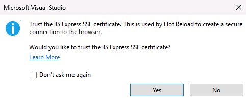
2.  You will get a security warning, asking you if you want to install this certificate. Click on **Yes**.

    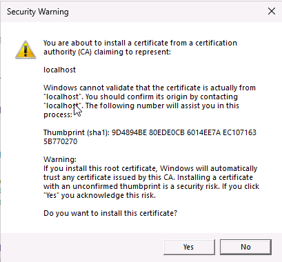


After you have trusted the certificate, two things will happen:

1. A terminal window will open, showing the logs of the Web API project.
2. Microsoft Edge will open directly on the Web API URL, which is `https://localhost:56025`. However, being an API, you won't see a traditional web page, just the message **Microsoft Copilot SDK Sample**.

The simplest way to test the agent is to use the [Bot Framework Emulator](https://github.com/microsoft/BotFramework-Emulator), an open-source tool from Microsoft that you can use to test agents created wth the Microsoft 365 Agents SDK without the need to deploy them to a real channel, which would require a bit of a setup (like the deployment of resources in Azure).

If you're doing this lab at MCAPS Tech Connect, the Bot Framework Emulator is already installed on the environment.

1. Press the Start icon in the Windows taskbar
2. Look for the Bot Framework Emulator icon and click on it to open it.
3. Once the main window opens up, click on the **Open Bot** button.

    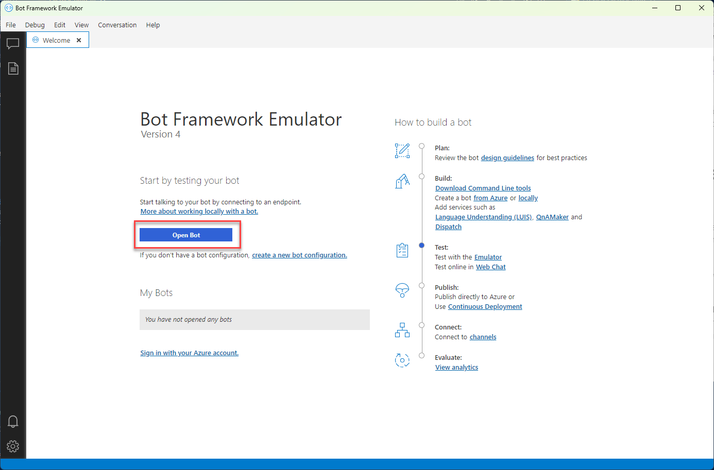

4. You will see different options to connect to your agent. The only important one, for the moment, is the **Bot URL**. Copy and paste the following URL:

    ```
    http://localhost:56026/api/messages
    ```

    [!Alert](Make sure to use the HTTP URL of the local Web API and not the HTTPS one)


    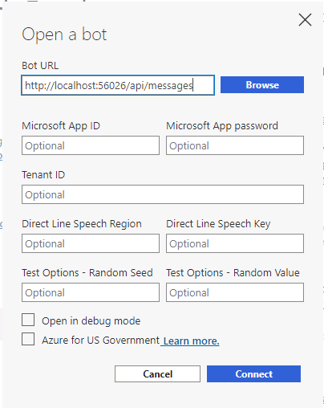

5. Click **Connect**.
6. The Bot Framework Emulator will open a live chat with your agent. In a few seconds, you should see the following message:

    ```
    Hello and Welcome!
    ```

    This is the welcome message we implemented in the `OnMembersAddedAsync()` method.

7. Type a message in the chat and press Enter. You should see the same message you typed, prefixed by `Echo:`.

    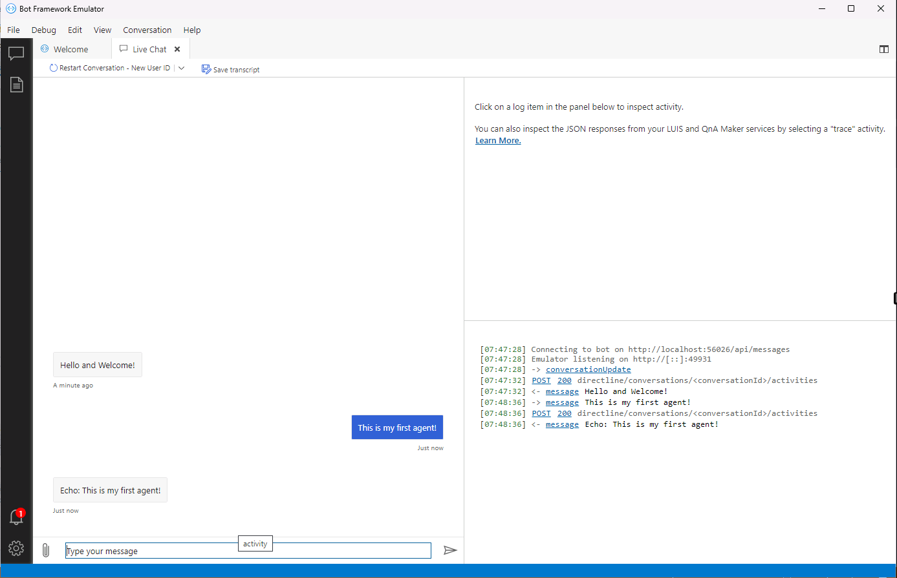

[!Knowledge](The Bot Framework Emulator is a powerful tool that allows you to test and debug your agent. For example, by clicking on the various messages exchanged between the user and the agent, you have the option to see the JSON payload that is sent to the REST APIs. We won't dive deep into these option in these lab, but it's good to know that they are available).

# Task 4: Deploy the agent to a real channel
Let's test the agent in a more realistic scenario by publishing it on a real channel, like a web application. To do that, we can't rely on the local Web API we're using now, but we need to leverage the Azure Bot Service. It's a service that acts as a bridge between your agent and the various channels where you want to deploy it, taking care of tasks like authentication, message dispatching, etc.

The Azure Bot Service runs in the cloud so, in a production scenario, you would need to publish your agent on the web before using it, using one of the many available service like Azure App Service, Azure Functions, etc. However, for the sake of this lab, we're going to keep the agent local and we're going to use a Dev Tunnel to connect it to the Azure Bot Service.

[!Knowledge](Dev Tunnel is a technology included in Visual Studio that allows you to expose a local service to the internet using a public URL, allowing a cloud application like the Azure Bot Service to communicate with it without needing to deploy it.)

As the first step, let's create the Dev Tunnel:

1. If the debugging is still running from the previous task, stop it.
2. In Visual Studio, click on the small arrow icon near the button which starts the debugging experience. You will see in the list the item **Dev Tunnels**, with the suffix **(No active tunnel)**.

    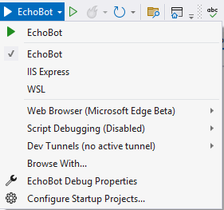

3. Expand the option and choose **Create a Tunnel**. You will see the following window:

    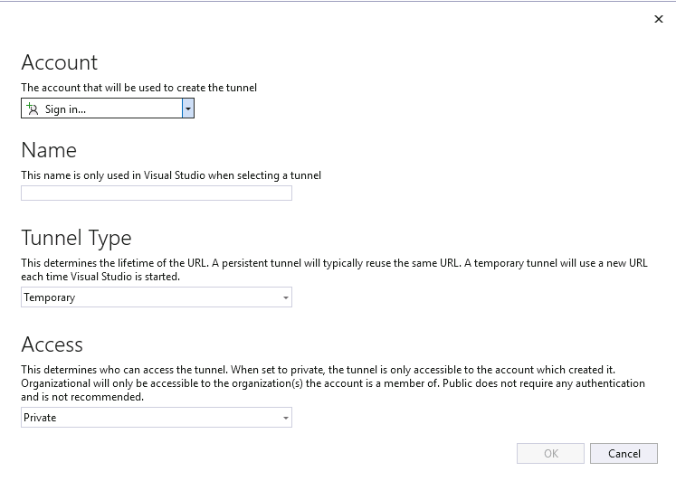

4. To create a Dev Tunnel you must be logged in with a Microsoft Account (work, school or personal) or with a GitHub account. Click on the **Account** dropdown and pick the option that works best for you: it can be your GitHub account, your personal Microsoft account or your work Microsoft account. All of these are valid options.

5. After you have logged in, make sure to set the following options:

    - **Name**: this is a free text, choose something meaningful like +++ MCAPS-M365AgentsSDK +++.
    - **Tunnel Type**: choose **Temporary**.
    - **Access**: choose **Public**.

6. Click **Ok**.
7. Now click again the small arrow icon near the button to start the debugging experience and make sure that, in the dropdown, you can see the name of the new Dev Tunnel you just created: 

    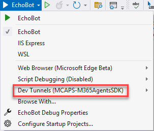

8. Press F5 to start the debugging experience. Visual Studio will start the Web API project like in Task 3 but, this time, you'll see that the URL that will be opened up in the browser will be a real public URL. Additionally, you will see the following page:

    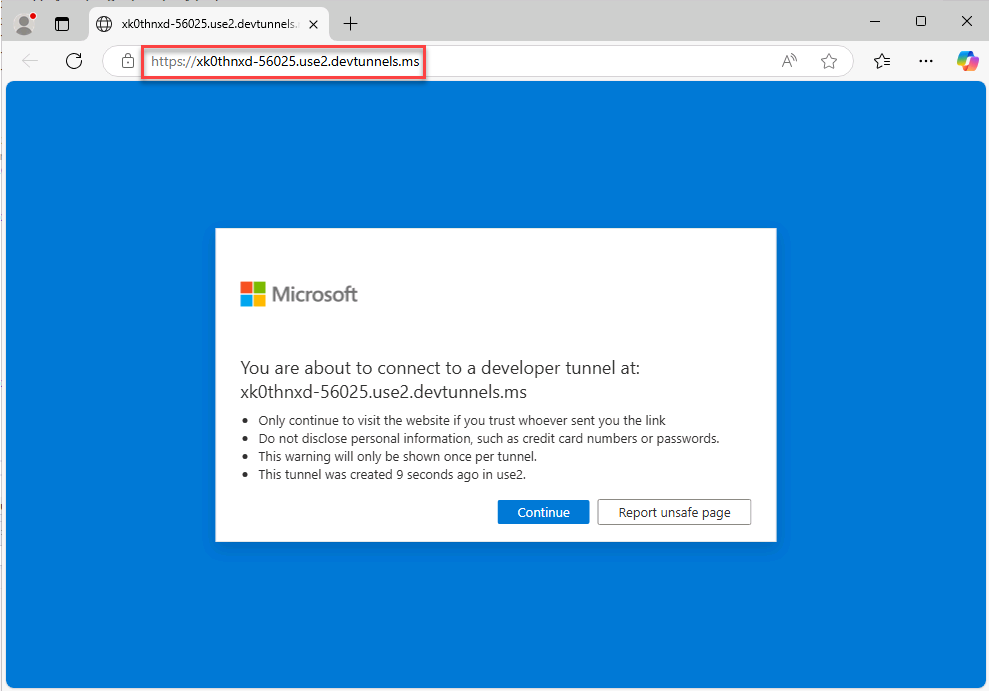

9.  Click on **Continue** in the page. You should see the familiar **Microsoft Copilot SDK Sample** message.
10. The agent is now up & running, but exposed through the public URL that was generated by the Dev Tunnel and that you can see in the address bar. Make sure to take note of the URL.

The next step is to configure the Azure Bot Service to use this URL, so that it knows where to dispatch the communications with the agent. We don't need to manually create the Azure Bot Service, since the script we have used in the **Prerequisites** section has already done it for us. Follow these steps:

1. Open the Edge browser.
2. Navigate to the Azure portal at [https://portal.azure.com](https://portal.azure.com).
3. When asked to login, use the following credentials:

    - Username: +++@lab.CloudPortalCredential(User1).Username+++
    - Password: +++@lab.CloudPortalCredential(User1).Password+++
  
4. You will land on the Azure portal (make sure to skip the tour and all the other options that might appear).
5. Under the **Navigate** section, click on **Resource groups**.
6. You will see a resource group called **ResourceGroup1**. Click on it.
7. Inside the resource group, you will see two resources: an Azure Bot Service and an Azure OpenAI resource.

    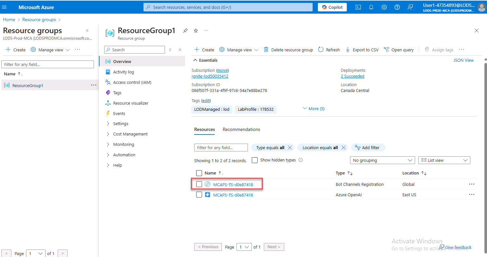

8. Click on the one with **Bot Channel Registration** as type.
9. In the left menu, expand the **Settings** section and click on **Configuration**.
10. Under the **Messaging endpoint** field, copy and paste the Dev Tunnel URL you have previously noted. Make sure to append `/api/messages` at the end of the URL. For example, if the Dev Tunnel URL is `https://pm5j7rdn-56025.use2.devtunnels.ms`, the final URL you must add in the field will be `https://pm5j7rdn-56025.use2.devtunnels.ms/api/messages`.
    
    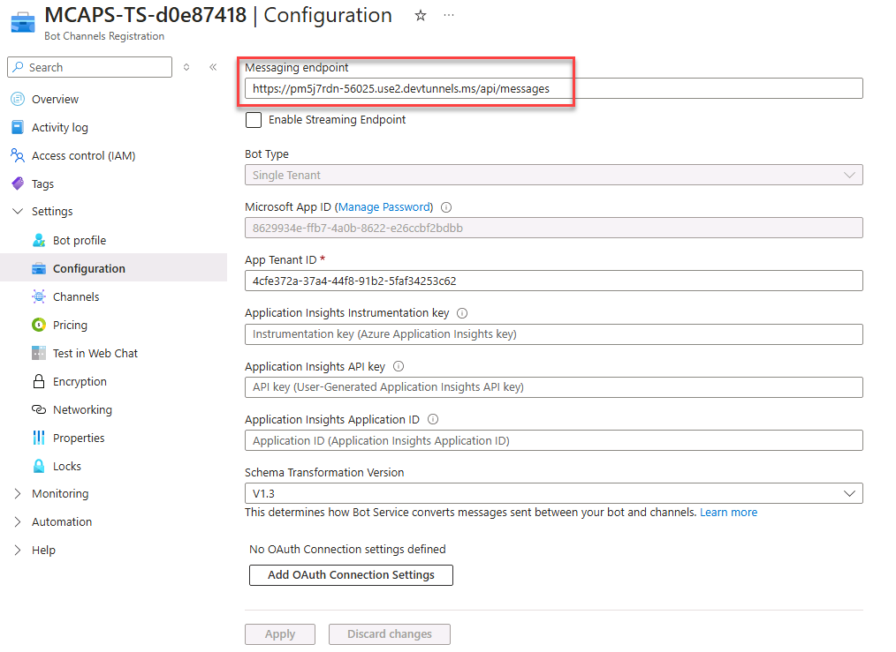

11. Click on **Apply** at the bottom of the page.


The Azure Bot Service communication is authenticated through a dedicated app registration on Microsoft Entra, which was automatically created as well by the script in the **Prerequisites** section. This means, however, that our agent, in order to properly work when it's used with the Azure Bot Service, needs to authenticate itself with the app registration. To do this, we need to make a few changes in our project in Visual Studio. The project already contains a file called `AspNetExtensions.cs`, which uses the ASP.NET Authentication library to manage the authentication with Microsoft Entra. However, it's currently disabled, so we need to enable it.

1. Go back to Visual Studio and locate, inside Solution Explorer, the `SampleServiceCollectionExtensions.cs` file.
2. You will find the following line commented:

    ```csharp
    //builder.Services.AddBotAspNetAuthentication(builder.Configuration)
    ```
3. Uncomment the line by removing the `//` at the beginning.

The next step is to configure the authentication: we need to supply to the agent the credentials to authenticate to our app registration. We do this in the `appssettings.json` file. Do you remember the list of credentials that was generated by the script a that we copied at the end of the **Prerequisites** section? We're going to use them now.

1. In the `TokenValidation -> Audience` property, copy and paste the value of the `App Id` key from the credentials list.
2. Look for the `Settings` section under `Connections -> BotServiceConnection` and make the following changes:

    - Under `AuthorityEndpoint`, you will find the following URL: `https://login.microsoftonline.com/{{TenandId}}`. Replace the `{{TenantId}}` placeholder with the value of the `Tenant Id` key from the credentials list.
    - Under `ClientId`, copy and paste the value of the `App Id` key from the credentials list.
    - Under `ClientSecret`, copy and paste the value of the `Secret` key from the credentials list.

    This is how your file should look like:

    ```json
    {
    "TokenValidation": {
        "Audience": [
            "8629934e-ffb7-4a0b-8622-e26ccbf2bdbb" // this is the Client ID used for the Azure Bot
        ]
    },
    
    "Connections": {
        "BotServiceConnection": {
        "Assembly": "Microsoft.Agents.Authentication.Msal",
        "Type": "MsalAuth",
            "Settings": {
                "AuthType": "ClientSecret", // this is the AuthType for the connection, valid values can be found in Microsoft.Agents.Authentication.Msal.Model.AuthTypes.  The default is ClientSecret.
                "AuthorityEndpoint": "https://login.microsoftonline.com/4cfe372a-37a4-44f8-91b2-5faf34253c62",
                "ClientId": "8629934e-ffb7-4a0b-8622-e26ccbf2bdbb", // this is the Client ID used for the connection.
                "ClientSecret": "<client-secret>", // this is the Client Secret used for the connection.
                "Scopes": [
                    "https://api.botframework.com/.default"
                ]
            }
        }
    },
    "ConnectionsMap": [
        {
        "ServiceUrl": "*",
        "Connection": "BotServiceConnection"
        }
    ],
    
    "Logging": {
        "LogLevel": {
        "Default": "Information",
        "Microsoft.AspNetCore": "Warning",
        "Microsoft.Copilot": "Warning",
        "Microsoft.Hosting.Lifetime": "Information"
        }
    }
    }
    ```

Before moving on to the next step, make sure to stop and relaunch the debugging experience, so that the agent can pick up the new configuration.

Now that both the local agent and the Azure Bot Service are properly configured, we can test it using one of the available channels supported by the Azure Bot Service. In the interest of time, we're going to use the simplest one: the Web Chat channel.

1. Go back to the Azure portal.
2. Launch the agent in Visual Studio by pressing F5.
3. In the Azure Bot Service resource, click on the **Test in Web Chat** button under the **Settings** section.
4. If you did everything right, you should see the agent behaving like when you tested it in the Bot Framework Emulator:
   - You will see the welcome message **Hello and Welcome!**.
   - Whenever you type a message, you will see the same message returned by the agent, prefixed by `Echo:`.
   
    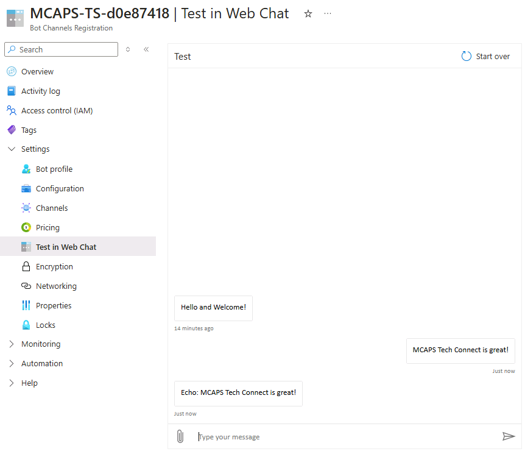

Congratulations! You have published your first agent to the web channel!
In the next exercise, you're going to empower your agent with Generative AI capabilities thanks to the LLMs provided by Azure OpenAI.