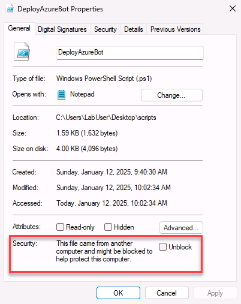
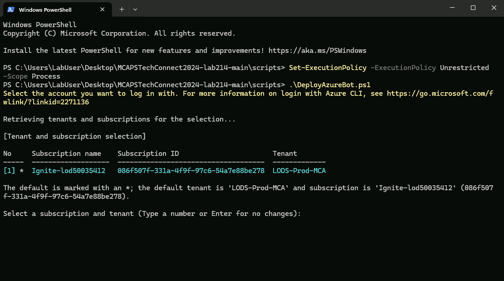

# Prerequisites
To perform this lab, you will need the following requirements:

- [Visual Studio 2022](https://visualstudio.microsoft.com/vs/) with the following workloads:
  - ASP.NET and web development
  - Azure development
- [Azure CLI](https://docs.microsoft.com/cli/azure/install-azure-cli)
- [An Azure subscription](https://azure.microsoft.com/)
- [Bot Framework Emulator](https://github.com/microsoft/BotFramework-Emulator). Note that if you're doing this lab at MCAPS Tech Connect, the Bot Framework Emulator is already installed in the environment.

If you're doing this lab at MCAPS Tech Connect, the environment is already set up for you.
Use the following credentials to log into the machine:

- Username: ++@lab.VirtualMachine(Win11-Pro-Base).Username++
- Password: +++@lab.VirtualMachine(Win11-Pro-Base).Password+++

You will need to download the lab files from the GitHub repository first and then provision the required resources on your Azure subscription. Let's start with the first task:

1. Open File Explorer
2. Double click on the C:\ drive.
3. Right click on an empty space in the File Explorer window and choose **New** > **Folder**.
4. Name it *src*.
5. Open the browser and type in the address bar the the following URL: +++https://github.com/microsoft/MCAPSTechConnect25-lab-214/archive/refs/heads/main.zip+++
6. Download the ZIP file to your computer and extract in the *C:\src* folder you have just created.

The next step is to run a PowerShell script, which is going to deploy on your Azure subscription the two resources which are needed to run the lab:

- An Azure Bot Service resource, with the corresponding app registration on Microsoft Entra
- An Azure OpenAI resource

To run the script, perform the following steps:

1. Open the folder *C:\src\MCAPSTechConnect25-lab-214\scripts*.
2. Right click on the **DeployAzureBot.ps1** file and click **Properties**.
3. At the bottom of the window, in the **Security** section, check the **Unblock** checkbox and click **OK**.

    

4. Right click on an empty space in File Explorer and choose **Open in Terminal**.
5. Type the following command and press Enter to enable the execution of the script:

    ```powershell
    Set-ExecutionPolicy -ExecutionPolicy Unrestricted -Scope Process
    ```

6. Run the script by typing the following command and by pressing Enter:

    ```powershell
    .\DeployAzureBot.ps1
    ```

7. The script will ask you to log in to your Azure subscription. If you're doing this lab at MCAPS Tech Connect, we're providing an Azure subscription for you. Choose **Work or school account**, then use the following credentials when asked:

    - Username: +++@lab.CloudPortalCredential(User1).Username+++
    - Password: +++@lab.CloudPortalCredential(User1).Password+++
  

8. Windows will ask you if you want to stay signed in all your apps. Click on the **No, sign in to this app only** link highlighted in the image below:

    

9. You will be asked to choose a subscription. Type `1` to select the only available one and press Enter.

    

10. The script will take a few minutes to complete. At this stage, you can now move to Exercise 1 and start the lab, meanwhile the scripts continues its execution. Once the job is completed, you will see a report like the following one:

    

11. Keep the terminal open. You will need these credentials later in the lab. In case you close the window by mistake, a backup copy of the credentials has been saved on your desktop in a text file named *Credentials.txt*.